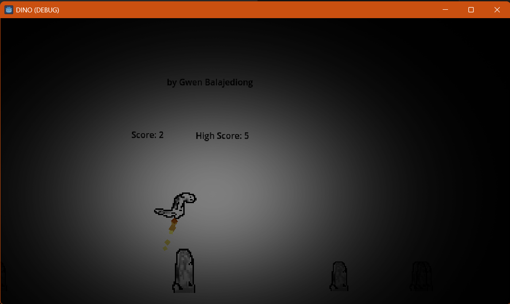

# 🦖 DINO Game

A simple offline DINO running game created as a fun project. Jump over obstacles, survive as long as you can, and beat your high score!

---

## 🎮 Features

- Smooth 2D gameplay
- Simple controls
- Score tracking

---

## 🖥️ How to Play

- Press **Spacebar** or **Mouse Button** to jump.
- Avoid obstacles.

---

## 📷 Screenshot

---

## 🧠 Made With

- 💻 Godot 4+ (GDScript)
- 🎨 Custom pixel art assets (Adobe PS)

---

## 📁 How to Run

1. Download the project
2. Run the executable
3. Enjoy the game!

---

## 👤 Author

Made by Gwen Balajediong

